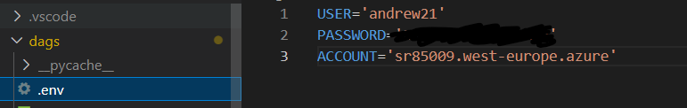
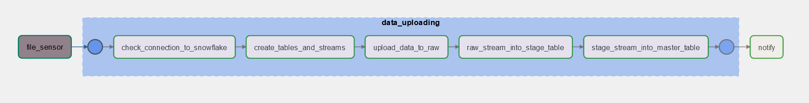
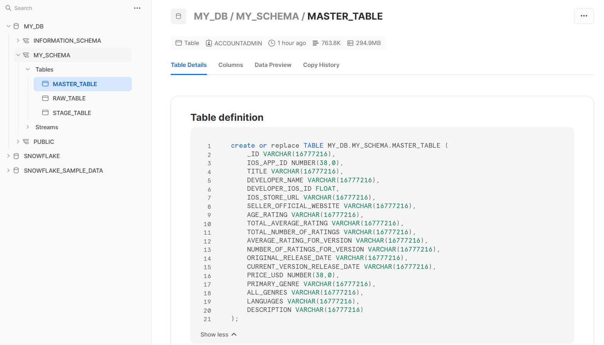

<h1>Airflow project</h1>

add a .env file with following contents:


Also add another .env file, this time in your dags folder with your snowflake user, password and account data:



Run ```docker-compose up airflow-init```
Then ```docker-compose up```

<h3>Note that i didnt include the 800mb csv file in the repository</h3>
You can use demo.csv for test which is essentially just 100 first rows of the original data.

<h2>Accessing the airflow:</h2>
When you see this line in your shell, that means that you can access the webserver:


Go to localhost:8080
Use the following username and password
user: airflow
password: airflow

<h2>Snowflake</h2>
Before executing the dag, you should create a warehouse with the name 'MY_WH', database with the name 'MY_DB' and lastly the schema named 'MY_SCHEMA'.

<h2>Connections</h2>
Add the following connections:


<h2>Running the dags</h2>
Now you can run the dag by pressing the corresponding button.
(Below is the dag for the reference)



<h2>Resulting snowflake tables</h2>


