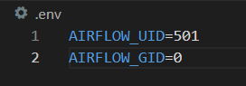
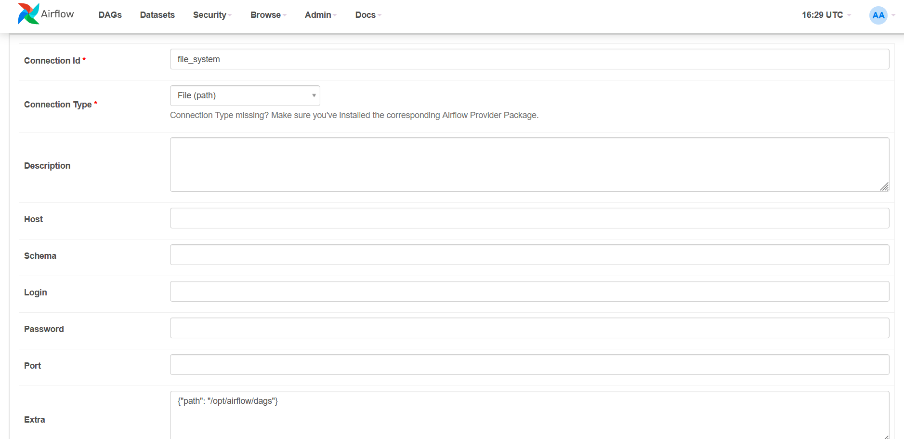
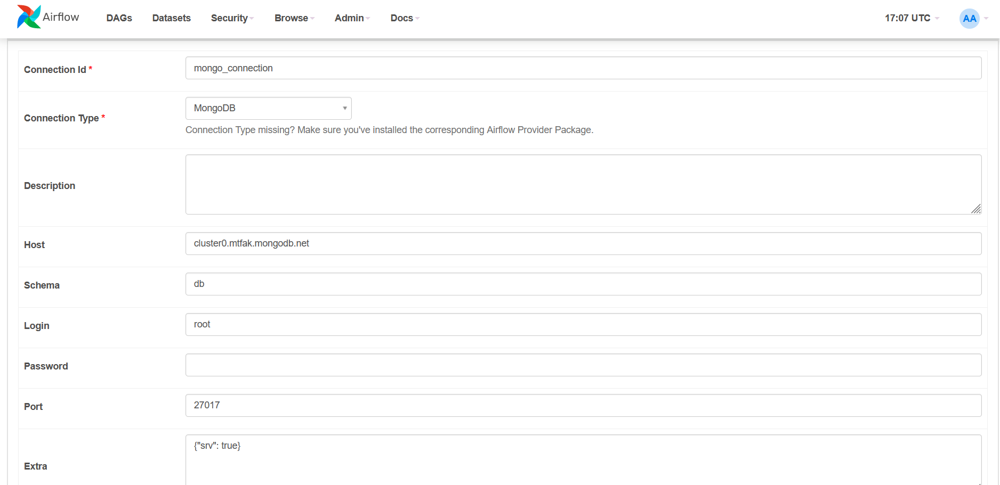

<h1>Airflow project</h1>

add a .env file with following contents:



Run ```docker-compose up airflow-init```
Then ```docker-compose up```

<h2>Accessing the airflow:</h2>
Connect to localhost:8080
user: airflow
password airflow

<h3>Connections</h3>
Add the following connections:





<h4>Mongo</h4>
To access the mongo shell do this:
- make sure your containers are running
- open a new terminal and write

```docker exec -it {your_mongo_db_container_name} /bin/sh```

```mongosh```

Now you are in mongo terminal

Let's switch to the data which we inserted using airflow, enter ```use reviews```

!!!Note that you have to specify the mongo container name in dag.py each time you recreate the container!!!

