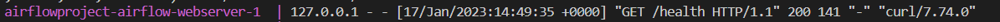
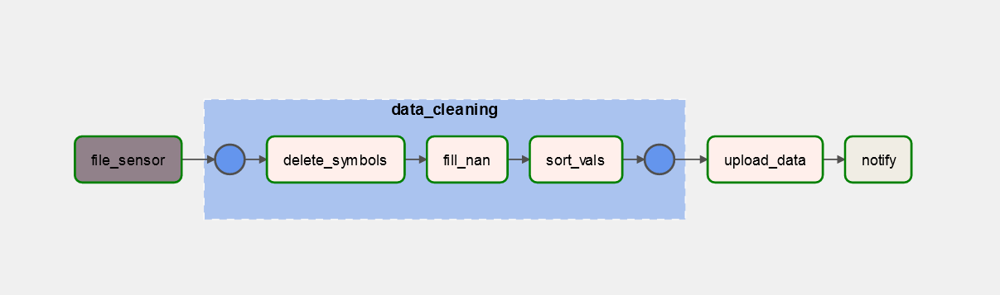

<h1>Airflow project</h1>

add a .env file with following contents:


Run ```docker-compose up airflow-init```
Then ```docker-compose up```

<h2>Accessing the airflow:</h2>
When you see this line in your shell, that means that you can access the webserver:



Go to localhost:8080
Use the following username and password
user: airflow
password: airflow

<h2>Connections</h2>
Add the following connections:


!!!Note that you have to specify the mongo container name in dag.py line 29 each time you recreate the container!!!
Otherwise the dag which uploads the data to mongo will fail.

<h2>Running the dags</h2>
Now you can run the dag by pressing the corresponding button.
(Below is the dag for the reference)



<h2>Mongo</h2>
To access the mongo shell do this:
- make sure your containers are running
- open a new terminal and write

```docker exec -it {your_mongo_db_container_name} /bin/bash```

```mongosh```

Now you are in mongo terminal
Write ```show dbs``` to view the dbs.
Let's switch to the data which we inserted using airflow, enter ```use reviews```
Now you can write any queries you need for the data.
